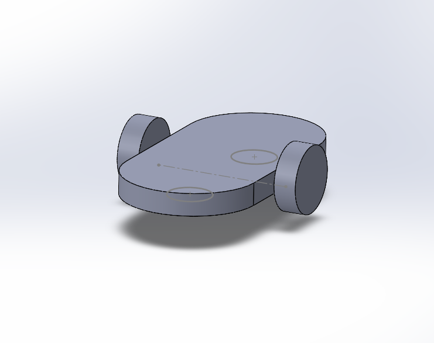
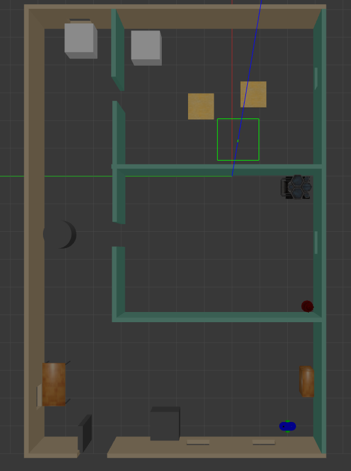
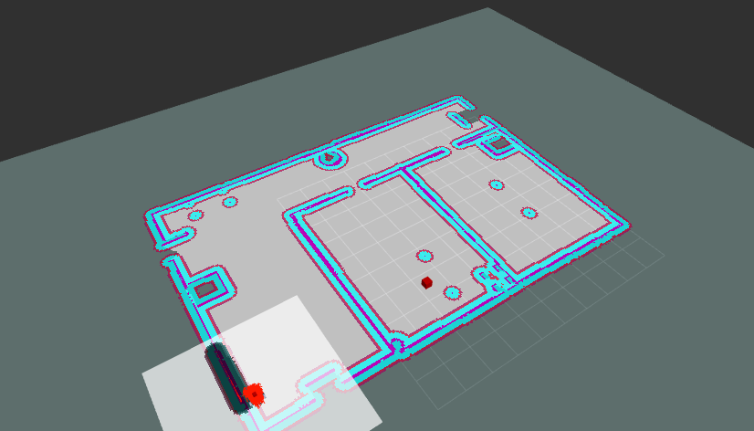

# RoboticsND-Home-Service-Robot

Final project for Udacity's Robotics Software Engineer Nanodegree.

A Home Service Robot simulated in ROS and Gazebo. The service-robot performs SLAM to map an indoor environment, localizes itself and autonomously navigates to pick up and place objects around the house.
The aim is to navigate to a pick-up location to collect a virtual object and then navigate to a specified drop-off zone to deposit it.

<p align="center" width="100%">
    
    <br>Home Service Robot Demo
</p>


Project info
------------

A custom differential drive robot designed using solidworks is used.

<p align="center" width="100%">
    
    <br>My Robot
</p>

The project consists of the following parts: 

* Design an indoor environment with the Building Editor in Gazebo.
* Create a 2D occupancy grid map of the environment by teleoperating the robot and performing SLAM using the `gmapping` package (utilizing odometry and laser scan data).
* Use Adaptive Monte Carlo Localization (AMCL) to localize the robot inside the environment with the `amcl` package (by utilizing odometry and laser scan data).
* Test the navigation stack and send a goal for the robot to navigate to via the 2D Nav Goal button in Rviz.
* Write a pick_objects node that commands the robot to navigate to the desired pick-up and drop-off zones.
* Write an add_markers node that subscribes to the robot odometry and publishes markers to Rviz to simulate the object pick-up and drop-off.

<br>
<p align="center" width="100%">
    
    <br>The Home Environment
</p>

Structure
---------

There are three packages in this project:
* **my_robot**: This package holds the Gazebo world, the amcl parameters, the rviz configurations, the generated map, the launch files to interface with all the packages and scripts to automatically run them.
* **pick_objects**: This package is responsible for commanding the robot to navigate to the desired pick-up and drop-off locations.
* **add_markers**: This package publishes markers to rviz to simulate the object pick-up and drop-off.
* **teleop_twist_keyboard**: This package is used to teleoperate the robot.
* **AMCL**: The AMCL (Adaptive Monte Carlo Localization) ROS package has been employed for localization tasks. AMCL is a probabilistic localization algorithm that utilizes a particle filter to estimate the robot's pose within a known map. It integrates sensor measurements with a motion model to adaptively adjust the particle distribution, providing accurate and robust localization even in dynamic environments. By leveraging AMCL, the robot is capable of determining its position and orientation relative to a given map with a high degree of precision.
* **Mapping**: For mapping the environment, the project relies on the GMapping (Grid-based FastSLAM) ROS package. GMapping is an efficient implementation of the FastSLAM algorithm, which combines laser scan measurements and odometry data to create a 2D occupancy grid map. This map represents the robot's perception of the surrounding environment, highlighting areas that are occupied, free, or unknown. GMapping allows the robot to build and update a map in real-time, enabling it to navigate effectively through various environments while avoiding obstacles.
* **Navigation**: The ROS Navigation Stack is utilized for navigation tasks in the project. This comprehensive package provides a modular and configurable framework for autonomous robot navigation. It incorporates various components such as path planning, obstacle avoidance, and trajectory execution. The navigation stack utilizes the information from the localization and mapping modules to plan a feasible path for the robot, considering the dynamic aspects of the environment. By combining AMCL for localization, GMapping for mapping, and the ROS Navigation Stack for path planning, the robot can autonomously navigate through complex environments while avoiding obstacles and reaching its destination.


The directory structure is depicted below:
```
. RoboticsND-Home-Service-Robot
├── LICENSE
├── README.md
├── add_markers                         # Publishes markers to Rviz to simulate the object pick-up and drop-off
│   ├── CMakeLists.txt
│   ├── package.xml
│   └── src
│       └── add_markers.cpp
├── my_robot
│   ├── CMakeLists.txt
│   ├── config                          # amcl parameters
│   │   ├── base_local_planner_params.yaml
│   │   ├── costmap_common_params.yaml
│   │   ├── global_costmap_params.yaml
│   │   ├── local_costmap_params.yaml
│   │   └── joint_names_my_robot.yaml # robot joint names
│   ├── launch
│   │   ├── amcl.launch            # Launches the amcl package for localization
│   │   ├── gmapping_demo.launch        # Launches the gmapping package for performing SLAM & creating a 2D map
│   │   ├── robot_description.launch    # Launches the robot
│   │   ├── view_navigation.launch      # Launches Rviz with saved config
│   │   └── world.launch                # Launches the home environment 
│   ├── map                             # The map of the environment
│   │   ├── home_service_map.pgm
│   │   └── home_service_map.yaml
│   ├── meshes                           # Robot link meshes
│   │   ├── base_link.STL
│   │   ├── leftwheel.STL
│   │   ├── rightwheel.STL
│   │   └── hokuyo.dae
│   ├── package.xml
│   ├── rviz
│   │   └── rviz.rviz
│   ├── scripts
│   │   ├── add_markers.sh
│   │   ├── home_service.sh             # To run the home service robot
│   │   ├── pick_objects.sh
│   │   ├── test_navigation.sh
│   │   └── test_slam.sh
├── urdf                                # Robot URDF files
│   │   ├── my_robot.csv
│   │   ├── my_robot.gazebo
│   │   ├── my_robot.xacro
│   └── worlds
│       └── home_v_2.world
├── images                              # Simulation images
│   ├── home.png
│   ├── home_service.gif
│   ├── home_service_map.png
│   └── rviz.png
└── pick_objects                        # Commands the robot to navigate to the desired pick-up and drop-off zones
    ├── CMakeLists.txt
    ├── package.xml
    └── src
        └── pick_objects.cpp
```

Technologies
------------

The project was developed on Ubuntu 20.04 LTS with:
* ROS Noetic
* Gazebo 11.11.0

Dependencies
------------

The following dependencies need to be installed:
```sh
$ sudo apt-get update && sudo apt-get upgrade -y
$ sudo apt-get install ros-noetic-teleop-twist-keyboard
$ sudo apt-get install ros-noetic-openslam-gmapping
$ sudo apt-get install ros-noetic-navigation
```

The scripts to run multiple packages utilize the xterm terminal which can be installed via:

```sh
$ sudo apt-get install xterm
```

Installation
------------

To run this project, you must have ROS and Gazebo installed.

#### 1. Create a catkin_ws, if you do not already have one.
```sh
$ mkdir -p /catkin_ws/src/
$ cd catkin_ws/src/
$ catkin_init_workspace
```

#### 2. Clone the project in catkin_ws/src/ and move its contents to src/.
```sh
$ git clon https://github.com/EngAhmed53/RoboticsND-Home-Service-Robot.git
$ sudo mv RoboticsND-Home-Service-Robot/* ./
```

#### 3. Build the packages.
```sh
$ cd /catkin_ws/
$ catkin_make
```

#### 4. Source your environment.
```sh
$ source devel/setup.bash
```

#### 5. Make the scripts executable.
```sh
$ cd src/home_service/scripts
$ sudo chmod +x *.sh
```


## Part 1: SLAM 

**Optional**: If you would like to test the SLAM algorithm and create a new map of the environment, run:
```sh
$ ./test_slam.sh
```

Teleoperate the robot through your keyboard to explore the environment and see the map appear in Rviz. Once the house is fully explored, save the map with:
```sh
$ rosrun map_server map_saver -f ../map/home_service_map
```

## Part 2: Navigation 

**Optional**: If you would like to test the navigation algorithm, run:
```sh
$ ./test_navigation.sh
```

Now you will be using the already generated map and localize with AMCL. Press the `2D Nav Goal` button in Rviz and click somewhere on the map to command the robot to navigate there.


<p align="center" width="100%">
    
    <br>Navigation
</p>


## Part 3: Home Service 

To simulate the full home service robot, run:
```sh
$ ./home_service.sh
```

The robot will be using the generated map and will localize itself with the `acml` package. It will navigate to a virtual object (indicated by a green cube in Rviz), pick-up the object (the cube will disappear to simulate the pick-up) and then the robot will navigate to a drop-off zone and deliver the object (the cube will re-appear once the robot reaches the drop-off location).


<br>
